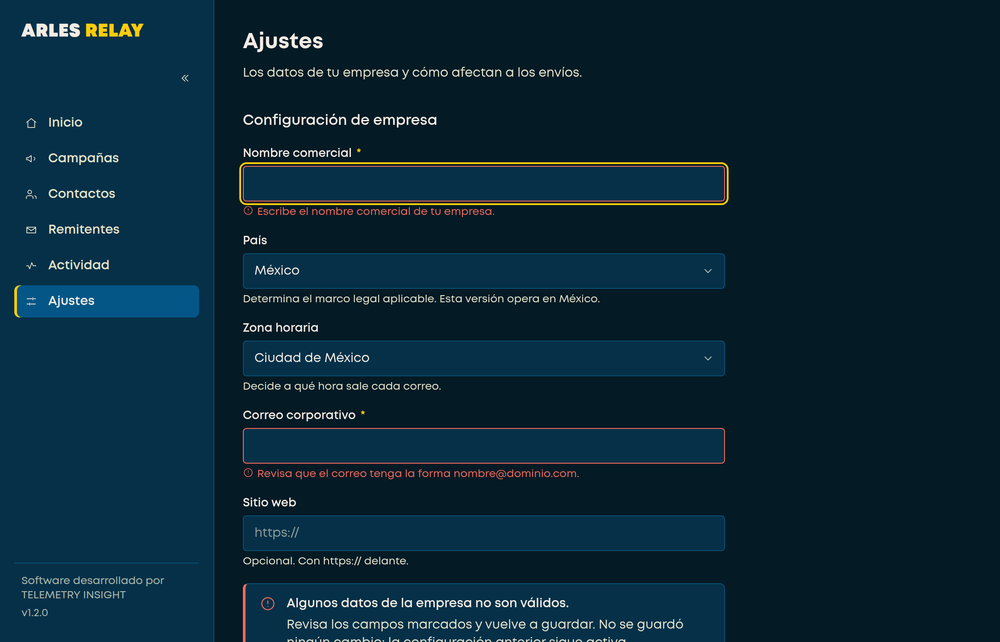
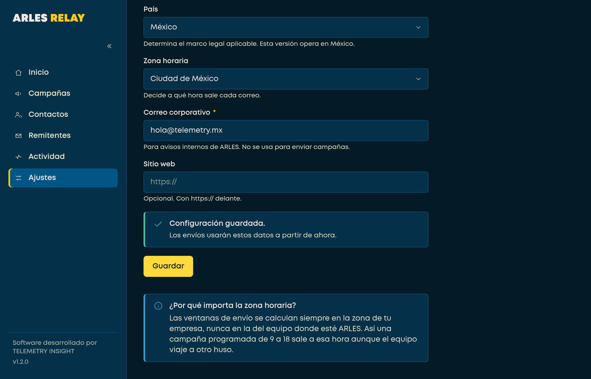
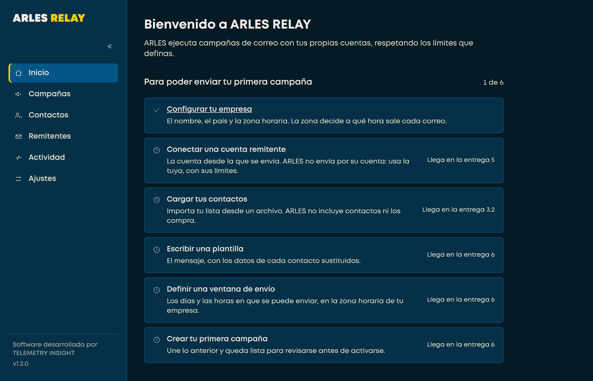
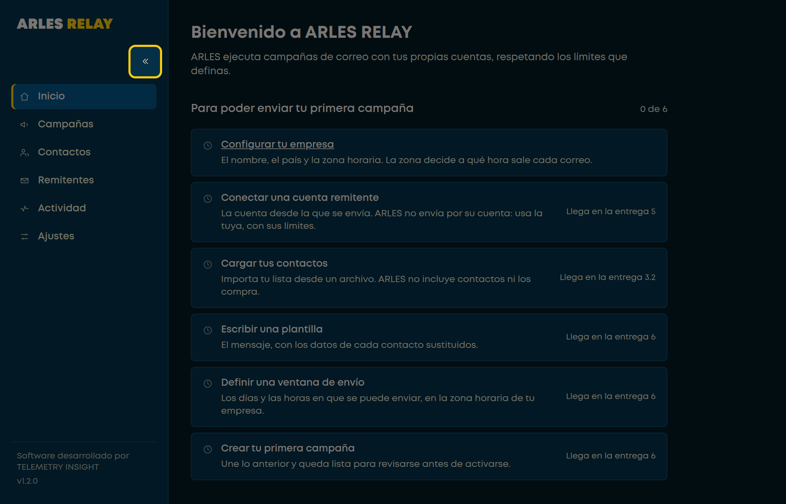
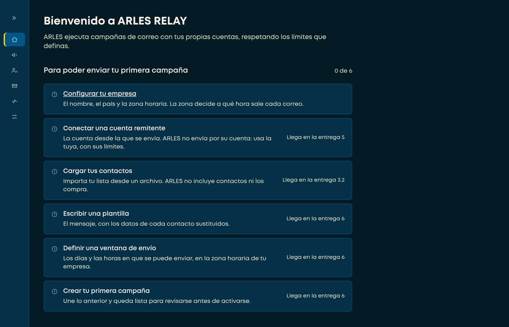
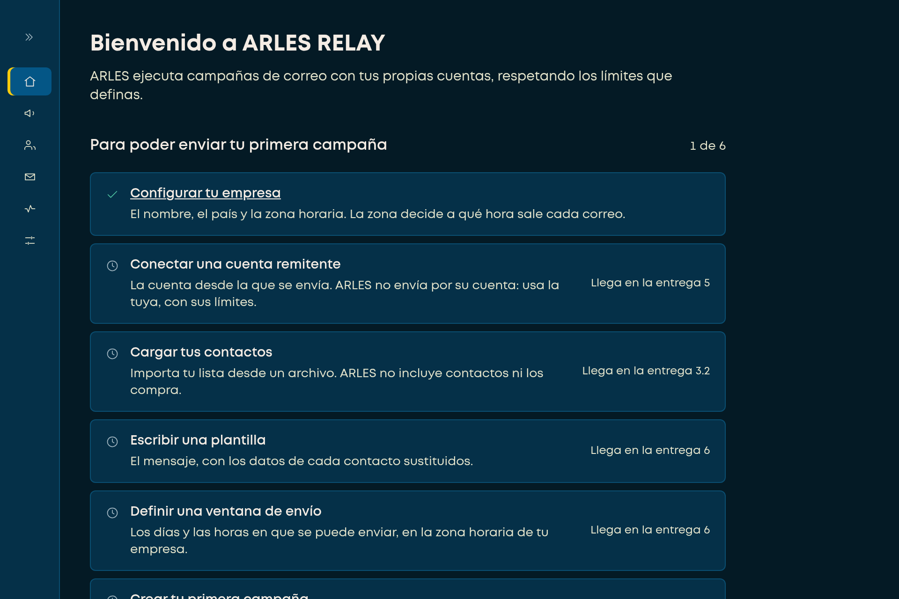

# Checklist de revisión · Entrega 3.1

> Configuración de empresa · lista de alta · barra lateral fija y plegable

Esta es la lista de lo que hay que comprobar con la aplicación abierta, paso a
paso. **Cada prueba dice qué hacer, qué debe pasar y deja sitio para anotar lo
que pasó.**

El PDF se genera desde este archivo:

```
python3 herramientas/checklist/generar-checklist.py \
    documentacion/06-calidad/CHECKLIST-3.1.md
```

---

## Cómo usar esta lista

Cada prueba tiene tres partes: **qué hacer**, **qué debe pasar** y una casilla.
Marca `Bien` si coincide, `Mal` si no, y **escribe qué viste** — una línea
basta. «No coincide» sin decir en qué no sirve de nada; «el botón no hizo
nada» sí.

!i Las imágenes de referencia salen del **mismo motor que usa Windows**
(Chromium, que es lo que hay debajo de WebView2). Lo que veas distinto en tu
pantalla es una diferencia real, no una diferencia de descripción. En Mac el
motor es otro —WKWebView— y **esperamos** diferencias pequeñas: anótalas, no
las des por fallos.

!! **No hace falta que lo hagas todo de una vez.** Son unos 35 minutos. Si
paras a la mitad, marca hasta dónde llegaste.

### Lo que NO hay que probar

No pierdas tiempo aquí: **no existe todavía**. Campañas, Contactos, Remitentes
y Actividad son pantallas de andamio y lo dicen. No hay envío de correo, no hay
importación y no hay contactos. Esta entrega son **dos pantallas y la barra**.

=== A · Antes de empezar

### A-1 · Instalar

1. Abre la página de la compilación:
   **github.com/AdrianPazG/ARLES/actions/runs/35004815794**
2. Baja hasta **«Artifacts»**, al final de la página.
3. Descarga `arles-revision-windows` (o `arles-revision-macos` si estás en Mac).
4. Descomprime el `.zip`.
5. Ejecuta el instalador que hay dentro.

!! **Windows va a avisarte, y es normal.** Saldrá una pantalla azul de
SmartScreen diciendo que protegió tu equipo. El instalador **no está firmado**
todavía —los certificados son de la Fase 9—, así que Windows desconfía de él
con razón. Para continuar: **«Más información»** → **«Ejecutar de todas
formas»**.

!! **En Mac, Gatekeeper hará lo mismo.** No hagas doble clic: **clic derecho
sobre la aplicación** → **«Abrir»** → **«Abrir»** otra vez en el diálogo. Sólo
la primera vez.

[[casilla]] Se instaló y abrió

### A-2 · La ventana

Lo más simple y lo que nunca se había visto hasta la revisión anterior.

1. Mira la barra de título de la ventana.
2. Mira la barra de tareas (Windows) o el Dock (Mac).
3. Arrastra una esquina de la ventana para hacerla lo más pequeña posible.
4. Maximiza la ventana.

=> Debe pasar: la barra de título dice **ARLES RELAY** y lleva su icono. La
ventana **no baja de 1120 × 720**: se frena sola. Maximizada, el contenido se
reparte y no se queda en una esquina.

[[casilla]] La ventana se comporta bien

=== B · Inicio · la lista de alta

### B-1 · Lo que se ve al abrir

La aplicación abre directamente en **Inicio**.

=> Debe pasar: un título **«Bienvenido a ARLES RELAY»**, y debajo
**«Para poder enviar tu primera campaña»** con **«0 de 6»** a la derecha y
**seis pasos** listados.


[[casilla]] Se ve así

### B-2 · Sólo el primer paso se puede hacer

1. Intenta pulsar **«Conectar una cuenta remitente»**.
2. Intenta pulsar **«Cargar tus contactos»**.
3. Ahora pulsa **«Configurar tu empresa»**.

=> Debe pasar: los cinco pasos de abajo **no son enlaces** —no pasa nada al
pulsarlos— y cada uno dice a la derecha en qué entrega llega: «Llega en la
entrega 5», «3.2», «6». Sólo **«Configurar tu empresa»** es un enlace, y lleva
a **Ajustes**.

!i **Que no se puedan pulsar es lo correcto**, no un fallo. Esas pantallas aún
no existen, y la lista lo dice en vez de llevarte a una pantalla en blanco.

[[casilla]] Sólo el primero es enlace, y los demás dicen su entrega

=== C · Ajustes · configuración de empresa

Es la primera pantalla del producto que guarda datos de verdad. **Aquí está lo
importante de esta revisión.**

### C-1 · Guardar con todo vacío

1. Si no estás en Ajustes, entra desde la barra lateral.
2. **Sin escribir nada**, pulsa **«Guardar»**.

=> Debe pasar: **dos campos se marcan en rojo** —Nombre comercial y Correo
corporativo—, cada uno con su mensaje debajo, **el cursor salta al primer campo
malo**, y abajo aparece un aviso rojo: «Algunos datos de la empresa no son
válidos.»

!x **Si al pulsar Guardar no pasa absolutamente nada, eso es un fallo grave** y
es exactamente lo que hay que cazar aquí. Anótalo y sigue.



[[casilla]] Se marcaron los dos campos y salió el aviso

### C-2 · El correo mal escrito

1. En **Correo corporativo**, escribe `hola` (sin arroba).
2. Pulsa **«Guardar»**.

=> Debe pasar: debajo del campo, el texto
**«Revisa que el correo tenga la forma nombre@dominio.com.»**

!x **Esta prueba es la más importante de la lista.** Justo este mensaje hacía
que la pantalla dejara de dibujarse: se quedaba como estaba, sin marcar nada y
sin decir nada. Está corregido, y esto es comprobarlo en el motor real. Si ves
que la pantalla se congela o que el mensaje sale con símbolos raros como
`{'@'}`, anótalo.

[[casilla]] Sale el mensaje del correo, completo y legible

### C-3 · El sitio web sin https

1. En **Sitio web**, escribe `telemetry.mx` (sin `https://`).
2. Pulsa **«Guardar»**.

=> Debe pasar: debajo del campo,
**«Escribe la dirección completa, empezando por https://.»**

[[casilla]] Sale el mensaje del sitio web

### C-4 · Los desplegables

1. Abre el desplegable **País**.
2. Abre el desplegable **Zona horaria**.

=> Debe pasar: **País** ofrece una sola opción, **«México»** — no «MX». **Zona
horaria** ofrece **doce**, la primera «Ciudad de México», y ninguna es un
código técnico del estilo `America/Mexico_City`.

!i Doce y no más: son las cuatro zonas de México, las de la frontera con
horario propio y UTC. Esta versión opera en México (decisión D-4), y ofrecer
doscientos países sugeriría un soporte legal que no existe.

[[casilla]] Se leen en español, no como códigos

### C-5 · Guardar bien

1. **Nombre comercial:** escribe el nombre de la empresa.
2. **Correo corporativo:** escribe un correo válido.
3. Borra lo que hubieras dejado en **Sitio web**, o escríbelo con `https://`.
4. Pulsa **«Guardar»**.

=> Debe pasar: desaparecen los rojos y sale un aviso verde:
**«Configuración guardada. Los envíos usarán estos datos a partir de ahora.»**



[[casilla]] Guardó y lo dijo

### C-6 · El aviso no se queda mintiendo

1. Con el «Configuración guardada» todavía en pantalla, **escribe cualquier
   cosa** en el nombre comercial.

=> Debe pasar: el aviso verde **desaparece** en cuanto empiezas a escribir.

!i Es un detalle pequeño con un motivo grande: «guardada» junto a un formulario
que ya se está editando afirma algo que ha dejado de ser cierto.

[[casilla]] El aviso desaparece al editar

### C-7 · La lista de alta avanza

1. Vuelve a **Inicio** desde la barra lateral.

=> Debe pasar: ahora dice **«1 de 6»**, y el paso «Configurar tu empresa» sale
marcado como hecho, con una palomita verde.



[[casilla]] Inicio dice 1 de 6

### C-8 · Los datos sobreviven al cierre

1. **Cierra ARLES por completo.**
2. Vuelve a abrirlo.
3. Entra en **Ajustes**.

=> Debe pasar: tus datos siguen ahí, tal como los guardaste. Y en **Inicio**
sigue diciendo **«1 de 6»**.

!! Si al reabrir ARLES sale un error hablando del **almacén de credenciales**
del sistema, **no lo cierres**: anótalo entero, con captura. Es el arranque
cifrado, y ese mensaje es información valiosa.

[[casilla]] Todo sigue después de cerrar y abrir

=== D · La barra lateral · lo que pediste

### D-1 · Plegarla a mano

1. Arriba de la barra lateral, a la derecha, hay un botón con **dos galones**
   apuntando a la izquierda: `«`.
2. Púlsalo.



=> Debe pasar: la barra se reduce a una **franja estrecha con sólo iconos**. El
logotipo y el pie desaparecen. El icono de la sección donde estás se sigue
distinguiendo.



[[casilla]] Se pliega y se distingue dónde estás

### D-2 · Plegada se sigue navegando

1. Con la barra plegada, **deja el ratón quieto** sobre un icono un segundo.
2. Pulsa un icono cualquiera.
3. Vuelve a **Inicio**.
4. Pulsa el botón de nuevo, ahora con los galones hacia la derecha `»`.

=> Debe pasar: al dejar el ratón encima sale el nombre de la sección. Los
iconos navegan igual que los nombres. El botón vuelve a desplegarla.

[[casilla]] Se navega plegada y se vuelve a desplegar

### D-3 · Se recuerda

1. **Deja la barra plegada.**
2. Cierra ARLES por completo.
3. Vuelve a abrirlo.

=> Debe pasar: abre **con la barra plegada**, como la dejaste.

!i Esto es la tercera decisión que tomaste sobre la barra, y es la única que no
se puede ver en una captura: sólo se comprueba cerrando y abriendo.

[[casilla]] Abre como la dejé

### D-4 · Se queda fija

1. Despliega la barra otra vez.
2. Ve a **Inicio** y haz la ventana más baja, hasta que la lista de seis pasos
   no quepa entera.
3. Desplaza el contenido con la rueda del ratón.

=> Debe pasar: **la barra lateral no se mueve.** Sólo se desplaza el contenido
de la derecha. El logotipo se queda arriba y el pie abajo.

[[casilla]] La barra no se mueve al desplazar

=== E · Escalado de Windows

Sólo Windows. Es donde apareció el defecto de la revisión anterior.

### E-1 · Subir la escala

1. Cierra ARLES.
2. **Configuración** → **Sistema** → **Pantalla** → **Escala**.
3. Ponla al **200 %**.
4. Vuelve a abrir ARLES y ponlo a pantalla completa.

=> Debe pasar: **la barra se pliega sola**, sin que pulses nada. El botón de
plegar queda **apagado**, y al dejar el ratón encima explica por qué: «La
navegación se pliega sola porque la ventana es estrecha.»



!i No es un fallo que el botón no responda a esa escala: con la ventana tan
estrecha, desplegada la barra se comería el espacio del contenido. Un botón que
se pulsa y no hace nada se lee como una avería, así que se apaga y lo dice.

[[casilla]] Se pliega sola y el botón lo explica

### E-2 · Lo que no debe pasar a ninguna escala

1. Con la escala al **200 %**, mira el borde inferior de la ventana.
2. Recorre Inicio y Ajustes.
3. Repite a **125 %**, **150 %** y, si puedes, **250 %**.

=> Debe pasar: **no aparece nunca una barra de desplazamiento horizontal**, y
no hay ningún texto ni tarjeta cortada por el borde derecho.

!x Esto es exactamente el defecto que encontraste en la revisión anterior. Si
vuelve a aparecer, **captura la pantalla entera sin recortar** y anota a qué
escala.

[[casilla]] Ninguna escala corta el contenido

!! **Vuelve a dejar la escala como la tenías** antes de seguir con tu trabajo.

=== F · Teclado

### F-1 · Recorrer sin ratón

1. Ve a **Inicio** y pulsa `Tab` varias veces seguidas.
2. Fíjate en dónde está el foco cada vez.

=> Debe pasar: el foco empieza en el **botón de plegar**, sigue por las seis
secciones en orden y entra al contenido. **Cada parada se ve**, con un
recuadro amarillo alrededor.

!x Si en algún momento no se ve dónde está el foco, es un fallo. Anota en qué
paso se perdió.

[[casilla]] Se ve dónde está el foco en cada parada

### F-2 · Guardar con el teclado

1. Ve a **Ajustes**.
2. Llega al botón **«Guardar»** con `Tab` y pulsa `Intro`.

=> Debe pasar: guarda igual que con el ratón.

[[casilla]] Se puede guardar sin ratón

=== G · Al terminar

### G-1 · Qué mandarme

1. Las **capturas** que hayas hecho, con nombres que digan qué son:
   `C-2-correo.png`, `E-1-escala-200.png`.
2. **Esta lista**, rellenada. En papel y fotografiada también sirve.
3. Un renglón sobre el equipo: **Windows 10 u 11**, tamaño de la pantalla y a
   qué escala trabajas normalmente.

!i **Lo que salga «Mal» es lo valioso.** Una lista con todo en «Bien» y una
frase de más vale menos que una con tres fallos bien descritos.

### G-2 · Lo que ya está comprobado, para que no lo repitas

| | |
|---|---|
| Que los textos se lean y se puedan copiar | Comprobado |
| Que no haya errores de contraste de color | Medido contra WCAG 2.2 AA |
| Que la tabla grande no se atragante | Medido con 5 001 filas |
| Lo que anuncia un lector de pantalla | Automatizado en cada compilación |
| El umbral al que se pliega sola la barra | Medido: 984 px |

Lo que **sólo** se puede comprobar con una pantalla real es lo de esta lista:
la ventana nativa, el escalado del sistema, y si esto tiene sentido cuando lo
usa una persona.
