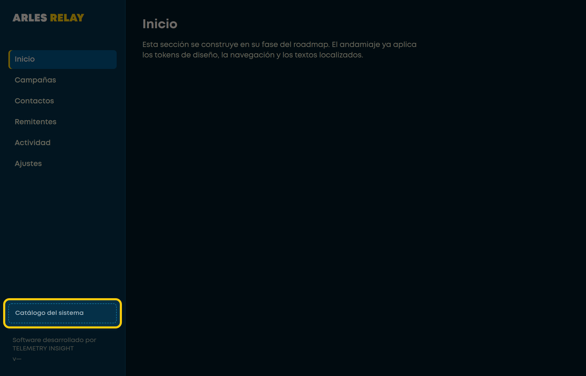
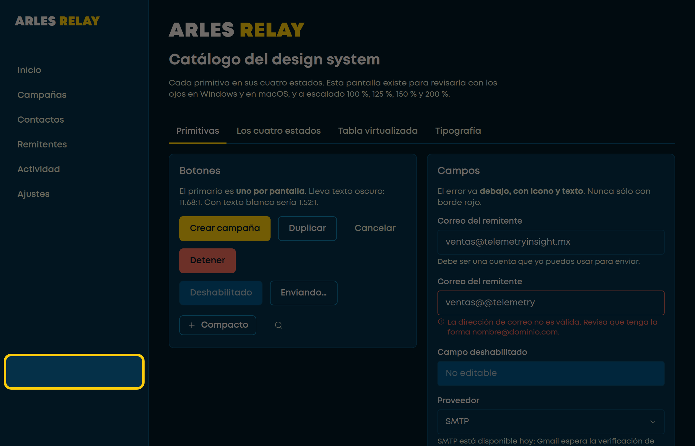
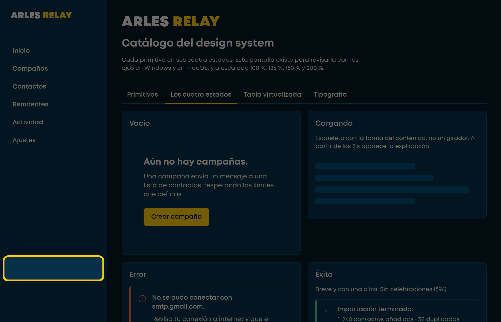
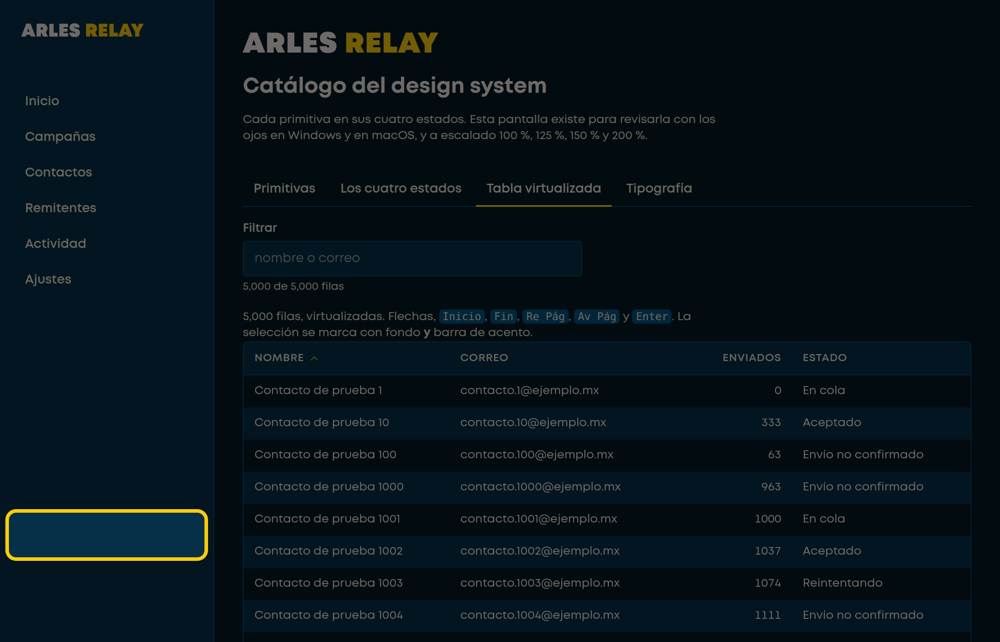
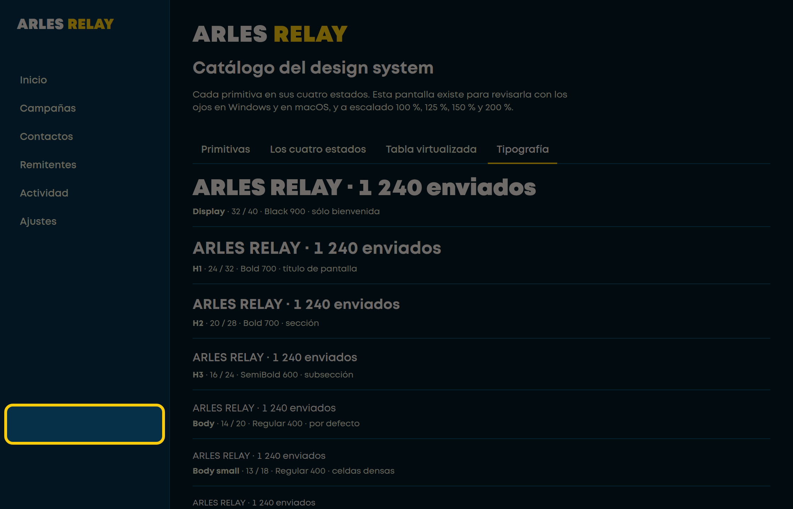
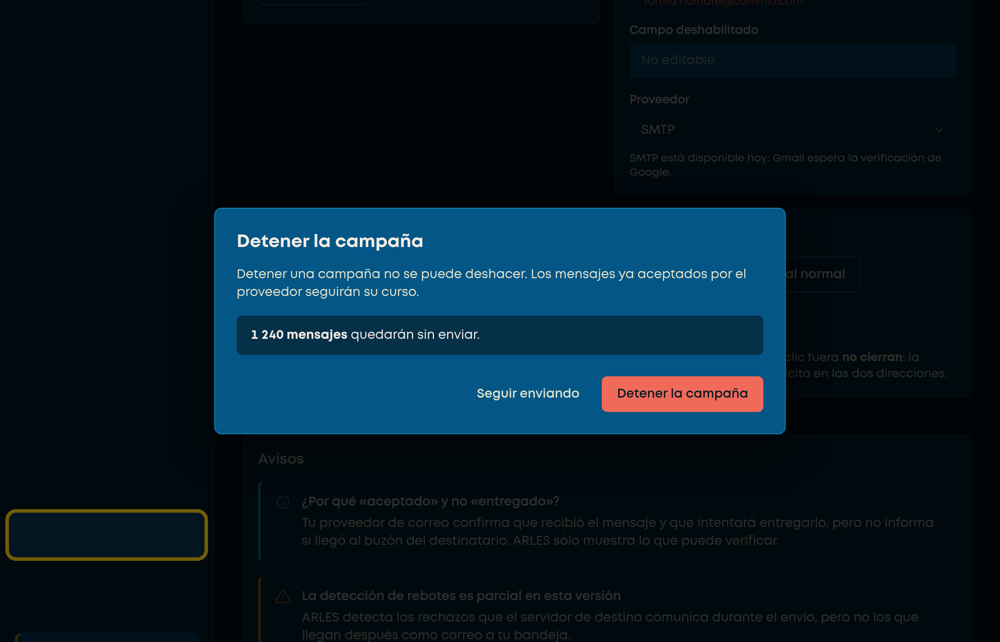

# Manual de revisión · **Windows**

**Para quien va a mirar la aplicación en Windows.** No hace falta programar ni
instalar herramientas de desarrollo.

> **Qué cierra esta revisión.** De los cuatro pendientes de la Fase 2, en
> Windows se cierran **tres**: la ventana nativa, el escalado del sistema y el
> lector de pantalla. El cuarto —el motor de macOS— se cierra en
> [el manual de Mac](MANUAL_MAC.md).

**Tiempo:** unos 40 minutos. Se puede partir en dos ratos.
**Vas a hacer 9 capturas**, todas con nombre `W-…`.

> 📱 **Este mismo manual, como página web:**
> **https://claude.ai/artifact/RAbRXPpaPWAzda6hX4f8w4**
>
> Se lee bien en el móvil mientras trabajas en el ordenador, lleva la cuenta de
> las capturas y un botón para copiar la plantilla.

---

## Índice

1. [Lo que necesitas](#1-lo-que-necesitas)
2. [Descargar el instalador](#2-descargar-el-instalador)
3. [Abrirlo: SmartScreen es normal](#3-abrirlo-smartscreen-es-normal)
4. [Llegar al catálogo](#4-llegar-al-catálogo)
5. [Las 6 primeras capturas](#5-las-6-primeras-capturas)
6. [El escalado: capturas 7, 8 y 9](#6-el-escalado-capturas-7-8-y-9)
7. [Comparar con las referencias](#7-comparar-con-las-referencias)
8. [NVDA, el lector de pantalla](#8-nvda-el-lector-de-pantalla) — *opcional*
9. [Ordenar y enviar](#9-ordenar-y-enviar)

---

## 1. Lo que necesitas

| | |
|---|---|
| **Windows 10 u 11** | El motor de la aplicación aquí es **WebView2**, que no es el mismo con el que construimos. Por eso hay que mirarlo aquí |
| Acceso al repositorio en GitHub | Para descargar |

**No hace falta** instalar Rust, Node, ni ninguna herramienta de desarrollo.
El instalador ya está compilado.

---

## 2. Descargar el instalador

👉 **https://github.com/AdrianPazG/ARLES/actions/runs/34879107021**

1. Abre ese enlace.
2. Baja hasta el final de la página, a la sección **«Artifacts»**.
3. Descarga **`arles-revision-windows`** — son 4,4 MB.
4. GitHub te lo da dentro de un **`.zip`**. Descomprímelo: dentro va un `.exe`.

> ⏳ **Caduca el 28 de septiembre de 2026.** Si ya pasó esa fecha, compilar una
> versión nueva son seis clics desde el navegador:
> [REVISION_VISUAL.md](REVISION_VISUAL.md).

> ❗ **Si «Artifacts» sale vacío, párate y dímelo.** No es normal: la
> compilación comprueba que el instalador existe antes de subirlo.

---

## 3. Abrirlo: SmartScreen es normal

**Esta compilación no está firmada.** Los certificados llegan en la Fase 9
(riesgo R-14). Windows va a protestar y hay que saltárselo **a propósito**.

Al abrir el `.exe` sale una pantalla azul:

> *Windows protegió su PC*

1. Pulsa **«Más información»**.
2. Pulsa **«Ejecutar de todas formas»**.

> Si esto te incomoda, es la reacción correcta: es exactamente lo que sentiría
> un cliente. Por eso los certificados están en el roadmap.

---

## 4. Llegar al catálogo

La aplicación abre en **Inicio**. El catálogo está en la barra lateral,
**abajo del todo y con borde punteado**:



Está ahí abajo y no parece una sección del producto **a propósito**: no lo es.
Es una herramienta de revisión que no viaja al cliente.

Al pulsarlo verás cuatro pestañas: **Primitivas · Los cuatro estados · Tabla
virtualizada · Tipografía**.

> Ese enlace **sólo existe en esta compilación**. En la que se instalaría en
> casa de un cliente no se pinta, y el catálogo no va dentro del programa — lo
> comprueba una verificación automática que inspecciona el paquete compilado.

---

## 5. Las 6 primeras capturas

**Antes de la primera:** arrastra el borde de la ventana para hacerla pequeña.
**No debe poder bajar de 1120 × 720.** Si baja más, es un fallo — anótalo.

| # | Nombre del archivo | Qué capturar | Qué mirar mientras |
|---|---|---|---|
| 1 | `W-01-ventana.png` | La ventana recién abierta, **con la barra de título visible**. No recortes | ¿Dice «ARLES RELAY»? ¿Hay icono en la barra de tareas? **¿Se ve nítido o borroso?** |
| 2 | `W-02-maximizada.png` | La ventana maximizada | ¿El contenido se reparte, o se queda en una esquina? |
| 3 | `W-03-primitivas.png` | Pestaña «Primitivas», pantalla completa | ¿El botón amarillo se lee bien? ¿El **deshabilitado** se distingue del normal **y aún se puede leer**? |
| 4 | `W-04-estados.png` | Pestaña «Los cuatro estados» | ¿El bloque de «Cargando» respira suavemente, sin parpadear? |
| 5 | `W-05-tabla.png` | Pestaña «Tabla virtualizada». Desplázate rápido antes de capturar | ¿Va fluido o da tirones? |
| 6 | `W-06-tipografia.png` | Pestaña «Tipografía» | ¿Los números de la columna quedan alineados en vertical? |

> **Cómo capturar:** `Win + Shift + S` recorta lo que quieras.
> La tecla `Impr Pant` copia la pantalla entera.
> Para la captura 1, **asegúrate de incluir la barra de título**.

**El icono nítido importa.** El `.ico` de la aplicación se regeneró
precisamente porque traía una sola imagen grande y Windows la habría
reescalado. Si aun así lo ves blando en la barra de tareas, dímelo.

---

## 6. El escalado: capturas 7, 8 y 9

Esto es el §22, y **es donde más se rompen las interfaces**. Es lo más valioso
de toda la revisión de Windows.

1. **Cierra ARLES.**
2. **Configuración → Sistema → Pantalla → Escala.**
3. Ponlo al **125 %**. Windows puede pedir cerrar sesión: hazlo.
4. Abre ARLES, ve al catálogo, pestaña **«Primitivas»**, captura.
5. Repite con **150 %** y con **200 %**.
6. **Devuelve la escala a lo que tenías.**

| # | Nombre del archivo | Escala |
|---|---|---|
| 7 | `W-07-escala-125.png` | 125 % |
| 8 | `W-08-escala-150.png` | 150 % |
| 9 | `W-09-escala-200.png` | 200 % |

**Qué buscar en cada una:**

- Texto **cortado** o con puntos suspensivos donde antes se leía entero.
- Botones que **se salen de su caja**.
- Dos cosas **encima de la otra**.
- **Barras de desplazamiento** donde antes no había.

A 200 % casi siempre aparece algo. Si no aparece nada, mira dos veces.

---

## 7. Comparar con las referencias

Así se ve el catálogo **desde el mismo motor que tienes tú** — Chromium, que es
el que hay debajo de WebView2 —, capturado automáticamente desde el
repositorio. En Windows la referencia y tu pantalla **deberían parecerse
mucho**.

### Primitivas



### Los cuatro estados



### Tabla virtualizada



### Tipografía



### Modal



### ⚠️ Diferencias que SON normales — no las reportes

La referencia sale de un navegador, no de la aplicación empaquetada. Vas a ver
estas cuatro diferencias y **ninguna es un fallo**:

| En la referencia | En tu pantalla | Por qué |
|---|---|---|
| Abajo a la izquierda pone **`v—`** | Pondrá **`v1.2.0`** | La versión la dice el núcleo de la aplicación. En un navegador no hay núcleo, y el guion es deliberado: se ve, y así el hueco no se disimula |
| **No hay barra de título** | La tendrá | La referencia es una página web; la tuya es una ventana de Windows |
| Barras de desplazamiento distintas | Las de Windows | Cada sistema pinta las suyas |
| El borde de la ventana | El de Windows | Igual |

**Todo lo demás sí cuenta.** Si algo se ve distinto y no está en esta tabla,
anótalo.

---

## 8. NVDA, el lector de pantalla

> ## ⚠️ Esta sección es **opcional** desde el 15 de septiembre de 2026
>
> Lo que pedía escuchar **ya se comprueba solo**, en cada compilación, con
> `sonda:lector`. NVDA no inventa lo que dice: lo deriva del árbol de
> accesibilidad del motor, y ese árbol se puede leer. «¿Dice botón?» dejó de
> ser una pregunta de oído y pasó a ser una de dato.
>
> Verificado automáticamente: todo control tiene nombre · el logotipo se
> anuncia como una sola cosa · sólo una pestaña seleccionada · el error va
> unido a su campo · la tabla anuncia 5 001 filas teniendo 18 en el DOM ·
> hay puntos de referencia de navegación.
>
> **Hazla sólo si te sobra el tiempo.** Lo que la máquina no puede saber es si
> el recorrido *tiene sentido* para alguien que no ve la pantalla, y eso sólo
> se descubre escuchando. Pero no bloquea nada.


**No hay que ser experto.** Basta con escuchar y decirme si lo que dice tiene
sentido.

1. Descarga **NVDA** de `nvaccess.org`. Es gratuito y de código abierto.
   Instálalo, o usa la **versión portable** si prefieres no instalar nada.
2. Arráncalo. Empezará a leer en voz alta lo que tengas enfocado.
3. **Ponlo en español** — ver abajo. Es obligatorio, no una comodidad.
4. Abre ARLES, ve al catálogo, y **navega sólo con el tabulador**. Nada de ratón.
5. Escucha.

Para apagarlo: **`Insert + Q`**.

### 8.1 Ponerlo en español · **no te saltes esto**

NVDA suele instalarse en inglés, y entonces dice *«button»*, *«tab»*,
*«row 40 of 5001»*. La tabla de aquí abajo te pide escuchar **«botón»**,
**«pestaña»**, **«fila 40 de 5001»**: con NVDA en inglés no puedes comprobar
lo que hay que comprobar, y acabarías reportando como fallo de ARLES algo que
es sólo el idioma del lector.

**No hace falta reinstalar.** Se cambia desde dentro:

1. Con NVDA arrancado, **`Insert + N`** abre su menú.
   *(En un portátil sin tecla Insert suele ser `Bloq Mayús + N`.)*
2. **Preferences → Settings** — atajo directo: **`Insert + Ctrl + G`**.
3. En la categoría **General**, el primer campo es **Language**.
4. Elige **`Español (España)`** o **`Español (Estados Unidos)`**. Cualquiera de
   los dos traduce la interfaz igual.
5. **OK**. NVDA pide reiniciarse: acepta (**Restart now**).

#### La voz es un ajuste distinto

El idioma de la interfaz y **la voz que lee** son dos cosas separadas. Puedes
acabar con NVDA en español leyendo con voz inglesa, y entonces el español suena
a trabalenguas.

1. **`Insert + Ctrl + V`** abre los ajustes de **Voz**.
2. Si el sintetizador es **eSpeak NG** —el que viene por defecto—, en **Voz**
   elige **`Spanish (Latin American)`**. Es la que mejor suena aquí.
3. Si prefieres una voz más natural, cambia el sintetizador a **Windows
   OneCore** con `Insert + Ctrl + S`. Ahí sólo saldrán voces en español si el
   idioma está instalado en Windows: *Configuración → Hora e idioma → Idioma y
   región → Agregar un idioma → Español (México)*, y dentro de sus opciones,
   **Voz**.

> **Para esta revisión, eSpeak en español basta de sobra.** Suena robótico,
> pero lo que hay que juzgar es **qué** dice, no cómo suena. No gastes tiempo
> instalando voces bonitas.

### 8.2 Qué escuchar

| Al llegar a | Debe decir algo como |
|---|---|
| El logotipo | *«ARLES RELAY, imagen»* — una sola cosa, no «ARLES» y «RELAY» por separado |
| Un botón | Su texto y la palabra «botón» |
| El campo con error | El texto del error **al entrar**, no sólo al salir |
| Una pestaña | *«pestaña, seleccionada»* o *«2 de 4»* |
| La tabla | **«fila 40 de 5001»** o parecido — el total real, no lo que se ve |

**Reporta esto, aunque parezca menor:**

- Algo que **no dice nada** al llegar.
- Algo que dice **«botón botón»** o repite.
- Un sitio donde **te pierdes** y no sabes dónde estás.
- La tabla anunciando **20 filas** en vez de las 5 001 reales.

🎙️ En vez de captura: **graba el audio o la pantalla**, o apúntame en la
plantilla lo que oigas mal. Cualquiera de las dos me sirve.

---

## 9. Ordenar y enviar

Crea una carpeta con **exactamente** estos nombres:

```
revision-windows/
├── W-01-ventana.png
├── W-02-maximizada.png
├── W-03-primitivas.png
├── W-04-estados.png
├── W-05-tabla.png
├── W-06-tipografia.png
├── W-07-escala-125.png
├── W-08-escala-150.png
├── W-09-escala-200.png
└── PLANTILLA-WINDOWS.md     ← rellenada
```

**Si una captura no la pudiste hacer, no la inventes: déjala fuera y dilo en la
plantilla.** Un hueco declarado es información; un hueco silencioso es un
agujero.

### La plantilla

1. Abre **[PLANTILLA-WINDOWS.md](PLANTILLA-WINDOWS.md)**.
2. Cópiala y rellénala. Se lee y se escribe en el Bloc de notas.
3. Donde pone `[ ]`, marca con una `x` si es que sí: `[x]`.
   Donde pone `_____`, escribe encima.
4. Mándame **la plantilla rellenada** y **las capturas**, aquí en el chat.

> **No hace falta que salga todo bien. Al contrario.**
>
> Si todo sale perfecto significa que esta revisión no encontró nada, y las dos
> fases anteriores dicen que eso es improbable: la Fase 2 se cerró con 18
> comprobaciones en verde y después, atacándola a propósito, aparecieron diez
> defectos más — uno de ellos habría tumbado la aplicación con 500 000
> contactos.

**Escribe lo que te chirríe aunque no sepas explicarlo.** *«Se ve raro»* es
información útil; el motivo lo busco yo.

---

## Lo que yo ya comprobé — no gastes tiempo aquí

| Ya verificado | Cómo |
|---|---|
| Contraste de todos los colores | Calculado, no a ojo. En cada compilación |
| La tabla virtualiza de verdad | 18 nodos para 5 000 filas — se midió porque **estaba mal** |
| El foco no se pierde ni se escapa del modal | Sonda de teclado automatizada |
| Ninguna parada de tabulación sin su anillo | 15 paradas, todas con señal visible |
| La política de seguridad no necesita relajarse | Recorriendo la aplicación bajo la política real |
| El catálogo no entra en la compilación de cliente | Inspeccionando el paquete compilado |

**Lo que sólo tú puedes ver** es lo de los pasos 5, 6 y 8: si en un Windows de
verdad, con WebView2 de verdad y a la escala que tú usas, esto se ve y se oye
como debe.

---

## ¿Tienes también un Mac?

Entonces hace falta la otra mitad: **[MANUAL_MAC.md](MANUAL_MAC.md)**.
Son 25 minutos más y cierra el cuarto pendiente, que es el motor de macOS —
el que más divergencias esperamos (riesgo R-07).

Si no tienes Mac, **manda sólo esto**. Media revisión sirve; ninguna, no.
